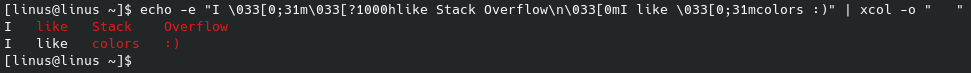

# xcol
xcol is an alternative to [column(1)](https://man7.org/linux/man-pages/man1/column.1.html) with better ansi/color support.

## Installation
In order to install, just run the following command

```
cargo install --force xcol
```

This will install git-user in your `~/.cargo/bin` (or Windows: `%USERPROFILE%\.cargo\bin`).

Make sure to add the `~/.cargo/bin` (or Windows: `%USERPROFILE%\.cargo\bin`) directory to your PATH variable.

## Comparison
column:
```
$ echo -e "I \033[0;31m\033[?1000hlike Stack Overflow\n\033[0mI like \033[0;31mcolors :)" | column -t -o "   "
I   like   Stack    Overflow
I   like          colors   :)
```

xcol:
```
$ echo -e "I \033[0;31m\033[?1000hlike Stack Overflow\n\033[0mI like \033[0;31mcolors :)" | xcol -o "   "
I   like   Stack    Overflow
I   like   colors   :)
```



## Help menu
```
xcol 0.1
Linus789

USAGE:
    xcol [OPTIONS]

FLAGS:
    -h, --help       Prints help information
    -V, --version    Prints version information

OPTIONS:
    -a, --alignment <alignment>
            Specify a column's alignment, may be repeated (default is left)
            Use 'l', 'r', 'c' for left, right, center alignment
            
            Examples:
            All columns left: xcol --alignment l
            Left, center, right: xcol --alignment lcr

    -o, --output-separator <output-separator>
            Specify the possible input item delimiters (default is whitespace)

    -s, --separator <separator>
            Specify the columns delimiter for table output (default is whitespace)
```